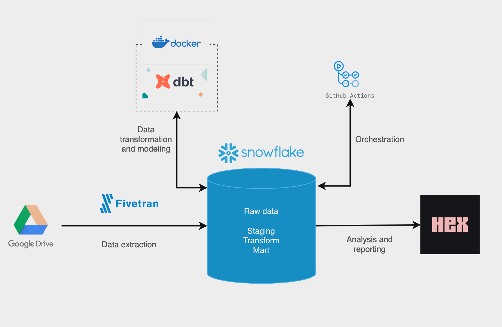
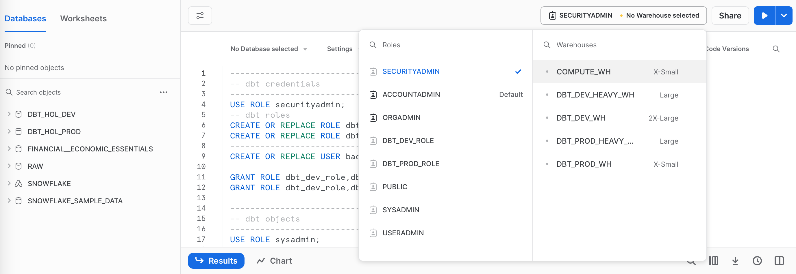
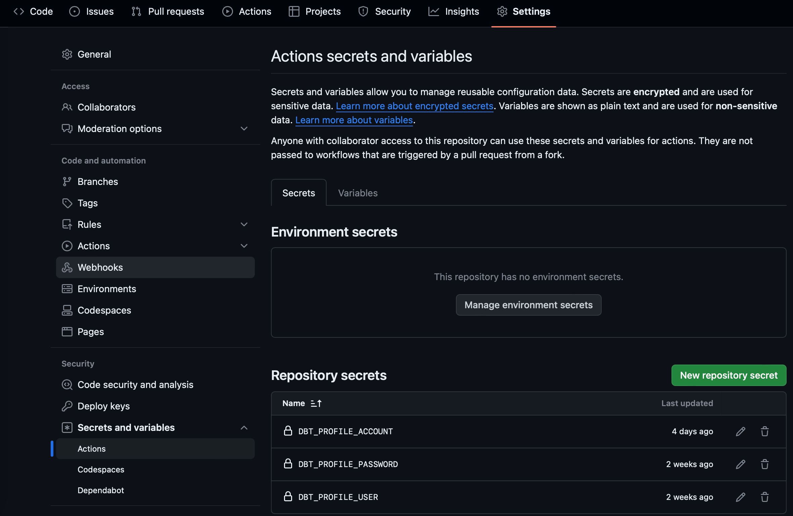
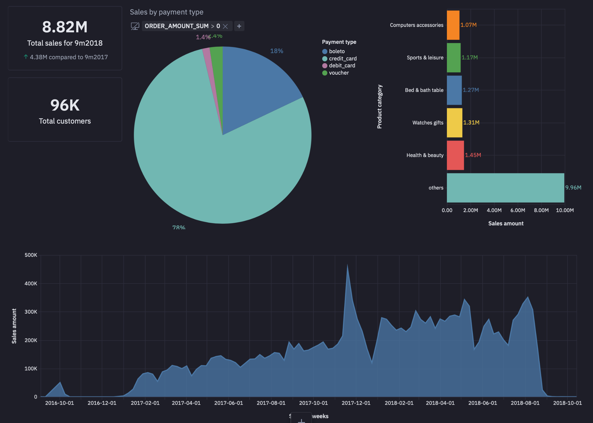

# dbt core with Docker, GitHub Actions, Fivetran and Hex

## Objectives

Run dbt project in Docker container that utilises public Brazilian ecomm dataset to demonstrate how to schedule dbt models through GitHub Actions for orchestration.

## Some explanations

- We use Docker in order to keep the same environment in different machines
- You can use AWS, Azure, GCP or any other data warehouse or database instead of Snowflake
- You can use any BI tool instead of Hex
- You can use Airflow or other tools for orchestration instead of GitHub Actions

## Requirements

- dbt [fundamentals](https://courses.getdbt.com/courses/fundamentals)
- Docker [1 hour crash course](https://www.youtube.com/watch?v=pg19Z8LL06w) or this [3 hours course](https://www.youtube.com/watch?v=_uZQtRyF6Eg&t=9978s)
- Installed Docker
- Downloaded [Brazilian ecomm dataset](https://www.kaggle.com/datasets/olistbr/brazilian-ecommerce)
- Fivetran trial
- Snowflake trial (or any data warehouse)
- Hex trial
- GitHub account [useful post](https://dbtips.substack.com/p/run-dbt-with-github-actions)

## Architecture

1) Dataset was saved on Google Drive
2) With Fivetran we can extract the data to the Snowflake
3) Transform data using dbt on Docker container
4) Set up orchestration with GitHub Actions
5) Analysis and reporting using Hex notebook



## Steps

### Snowflake

- Create in Snowflake new roles, warehouse, databases and schemas for your dbt project. It's great to have "dev" and "prod" roles and databases. If you have warehouse (compute) for each role, then you can optimize your cost.
We are going to use "DBT_HOL_DEV" and "DBT_HOL_PROD" databases.

You can learn more about roles, warehouse, databases in [this tutorial](https://quickstarts.snowflake.com/guide/data_teams_with_dbt_core/index.html#2)

### dbt
- Create new folder "my_new_project". In this folder we will create folder with virtual environment and folder with dbt project
- Go to this folder in terminal/cmd
```javascript
cd path/to/my/folder
```
- Create a new virtual environment where "dbt-venv" is name of virtual environment and you can choose your name
```javascript
python3 -m venv dbt-venv
```
- Activate the virtual environment:

For MacOS:
```javascript
source dbt-venv/bin/activate
```

or Windows:
```javascript
dbt-venv\Scripts\activate
```

- Install dbt adapter for Snowflake. It installs dbt-core and dbt-snowflake
```javascript
pip install dbt-snowflake
```

- Initiate dbt project. There will be created a folder with the name of dbt project
```javascript
dbt init my_new_dbt_project_name
```

- Input credentials for Snowflake in terminal or input it in "profiles.yml"
```javascript
my_new_dbt_project_name:
  outputs:
    dev:
      type: snowflake
      account: <account_name>
      warehouse: <dev_warehouse_name>
      database: <dev_database_name>
      schema: <schema_name>
      role: <role_name>
      authenticator: snowflake
      user: <user_name>
      password: <password>
      threads: 1
  target: dev
```
Target "dev" means that we want to build dbt model in "dev" database

- Deactivate virtual environment
```javascript
deactivate
```

### GitHub

- Create a GitHub repository with the project name.
In the folder with dbt project run the command
```javascript
git remote add origin <SSH path>
git push -u origin main
```

### Fivetran

- We can use Snowflake storage for our CSV, but it allows to download files less than 50 Mb. One of our files from Brazilian dataset is more than 50 Mb, so we can use Amazon S3 bucket, Azure Storage, GCP or just our Google Drive and Fivetran to connect it with Snowflake

- After connection Fivetran creates schema with our files

### Return to the dbt

- It's easy to use VSCode. In the terminal, you need to choose folder with dbt project and activate the virtual environment
```javascript
source dbt-venv/bin/activate
```
- You need to find folder "models" and create a file with name "source.yml". In this file you can describe sources from your "raw" layer in data warehouse. Then you can refer to this sources in staging models. There is best practice in dbt documentaion, when you have 3 layers: staging, intermediate and business. We changed these names to staging, transform and mart

- When you have all models for each layer you can run dbt models with 
```javascript
dbt run
```

or you can run each model, for example "staging", with 
```javascript
dbt run --models staging
```

- You can add tests, documents and other features of dbt. It's up to you

- If "dbt run" works without errors, we can implement GitHub Actions

### GitHub Actions

- In the folder with our dbt project we need to create folder ".github" and inside this folder another one with the name "workflows". it's our target folder where we save our "dbt_prod.yml" (or your file name) file for GitHub Actions. It's our step by step description. We can choose trigger, for example, on Push or timestamp

- If you don't have "profiles.yml" in the folder with dbt project, we need to create it. The default path for "profiles.yml" is "~/.dbt". In our new "profiles.yml" we need to save all connections. It is strongly recommend to create GitHub secret, in order not to keep credentials in public repository. So we use variables for account, user and password. 
We use secret for "prod" and dbt variables for "dev"


- When we have two "profiles.yml" (default path and dbt project path), we need to specify in "dbt_prod.yml" which file GitHub Actions must use. 
There are two options how to do this:
1) Copy "profiles.yml"
```javascript
- name: Prepare DBT profiles directory
  run: |
    mkdir -p ~/.dbt
    cp profiles.yml ~/.dbt/profiles.yml
  working-directory: ./
```
2) Point out directory
```javascript
- name: Run the models
  run: dbt run --profiles-dir ./ --profile github_actions --target prod
  working-directory: ./
```

- In addition, we need to create file "requirements.txt" with libraries for Python
```javascript
dbt-core
dbt-snowflake
```

- Eventually, we can run GitHub Actions and check the result

### Docker

- Create "Dockerfile" in the directory with dbt project

- Build Docker image with command ("my-dbt-project" it's your image's name)
```javascript
docker build -t my-dbt-project .
```
- Run Docker container. We have to pass Docker our credentials, because in "profiles.yml" we use variables 
```javascript
docker run -e SNOWFLAKE_ACCOUNT=<account> -e SNOWFLAKE_USER=<user> -e SNOWFLAKE_PASSWORD=<password> my-dbt-project
```

### Hex

- We can use it for data analysis and building dashboards. It's not so powerful like Tableau or Power BI, but it's enough to build some simple dashboard and share it

- First of all, we need to create connection with data warehouse

- After that we can use our mart layer (or whatever you want)


## Summary

Now anyone can work with dbt project. Docker allows to keep the environment and you can avoid issues with "it's not working on my machine". 
There are few steps how to work with dbt project:
1) Copy remote repository to your local machine
2) Work with your project
3) When you are ready to run dbt project, run Docker build
4) Run Docker container, which run "dbt run" command
5) Commit and Push changes to the remote repository
6) GitHub Actions run "dbt run" for prod
7) Build some dashboards in Hex and analyze data
